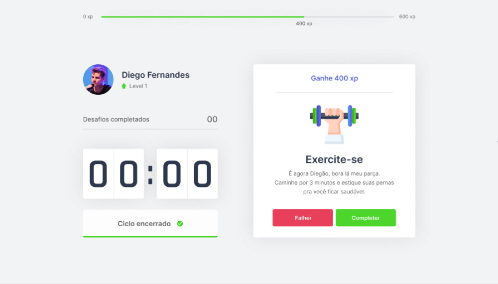

<p align="center">
   
</p>

# About

A Aplicação é um cronômetro que utiliza a técnica pomodoro para que ao final dos ciclos o usuário receba um exercício para ser feito.

Esta projeto foi desenvolvido durante o evento NLW#04 - Trilha de React da <a href="https://rocketseat.com.br"> Rocketseat </a>.

# Layout

<p align="center">
    <a title="Open with figma" href="https://www.figma.com/file/dUxfayFz06HvAXC4CJIG6E/Move.it-Layout">
        
    </a>
</p>




# Tecnologias

Este projeto foi desenvolvido utilizando as seguintes tecnologias:

- [Next.js](https://nextjs.org/)
- [React](https://reactjs.org)
- [TypeScript](https://www.typescriptlang.org/)

# Preview

<a title="Open with figma" href="https://moveit-rawallon.vercel.app/">

</a>

# How to run

Clone the project and access the folder

```bash
$ git clone https://github.com/Rawallon/move.it.git && cd move.it
```

Follow the steps below

```bash
# Install the dependencies
$ yarn

# Start the project
$ yarn dev
```
